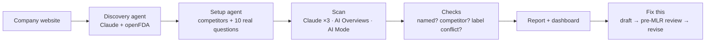

<p align="center">
  
</p>

<h3 align="center">See what AI tells patients and doctors about your drugs, and fix it before it costs you.</h3>

<p align="center">
  AI visibility and pre-MLR for pharma brands. Aeon asks Claude, Google AI Overviews and Google AI Mode the questions
  real patients, caregivers and doctors ask, checks every answer against your FDA label, and turns what's wrong into
  on-label content that has already passed a pre-MLR review.
</p>

<p align="center">
  
  
  
  
  
</p>

<p align="center">
  
  <br><sub>The dashboard on a real live scan of arcutis.com (Zoryve), not a mock-up.</sub>
</p>

---

## Why

Patients, caregivers and doctors now ask AI about treatments. When an assistant recommends a competitor for "best cream for plaque
psoriasis", or quotes an age limit from a label that has since changed, the brand team usually never finds out, and
anything they publish to fix it has to get through medical, legal and regulatory (MLR) review first.

Aeon shows both problems for one drug in about six minutes, from nothing but the company's website.

## What it does

| | |
|---|---|
| **Finds your portfolio** | An agent reads your website and confirms every product against its FDA label on openFDA. No forms. |
| **Asks the real questions** | 10 questions per drug, drawn from what people ask on Google and rounded out by the setup agent: unbranded, branded and comparison questions for patients, caregivers and doctors. |
| **Asks every engine** | Claude (asked 3 times, majority vote), Google AI Overviews and Google AI Mode. ChatGPT, Gemini and Perplexity are next. |
| **Checks, not scores** | Every result is a yes/no check you can open: does the answer name you, name a competitor instead, or contradict your label? Summaries are counts of checks ("2 of 18"), never a made-up 0–100 score. |
| **Label conflicts** | Each answer is compared with the current FDA label, quoting the AI sentence next to the label sentence. |
| **Fix this** | Drafts on-label content for each gap from the label alone, and revises it round by round until an automated pre-MLR checklist passes, so MLR sees a clean first draft. |
| **Tracks it weekly** | The same questions every week, so you see where AI moves toward or away from your brand. |

<p align="center">
  
  <br><sub>Every check opens the answer behind it: all three Claude samples, the sources, and who it named instead.</sub>
</p>

## How it works



- **Agents** run on the Anthropic SDK's tool runner: they read pages, look labels up and record what they find,
  and every step streams live to the screen.
- **Measurement is not an agent.** The scan is a fixed workflow, so the instructions never change the answers being
  measured.
- **Durable jobs** live in the database, so a restart or a dropped connection resumes the work instead of losing it.
- **Every call is traced** in Langfuse, with evals for the label checks, the pre-MLR review and the fix loop.

| Measured on a live run (arcutis.com, Sonnet 5) | Time | Cost |
|---|---|---|
| Discovery: website → products and FDA labels | ~1 min | $0.07 |
| Setup: competitors and questions | ~1 min | $0.06 |
| Scan: 10 questions × 3 engines, label checks | ~4 min | $2.93 |
| **A full report** | **~6 min** | **~$3** |

## Built to be trusted

- **No fabricated numbers.** No invented customers, ratings or results. Third-party figures show their source.
- **Demo mode says so.** The free demo replays one recorded scan, and a banner on every screen says which site it
  is. It never passes for a scan of the site you typed.
- **Guardrails on live runs.** Anything that isn't a real website is refused before anything runs. Visitors get one
  free report a day, "Fix this" and weekly tracking need an account, and live spend stops at a daily cap.
- **Your label is the reference.** Checks compare answers with the label on openFDA, across every form of the
  brand (Zoryve cream and foam, for example).

## Run it on your machine

Needs Node 24 (`.nvmrc`) and Python 3.11+.

```bash
npm install
npm run setup:api                 # backend/.venv with the backend installed
cp .env.example .env.local        # frontend → API on localhost:8000
```

Start the API in one terminal and the app in another:

| Mode | API | What you get | Keys |
|---|---|---|---|
| **Demo** | `npm run dev:api:demo` | Every website replays one recorded live scan (incyte.com), labelled as such. Free. | none |
| **Live** | `npm run dev:api` | A real analysis of any US pharma website. | `backend/.env` |

```bash
npm run dev                       # http://localhost:3000/start
```

For live mode, `cp backend/.env.example backend/.env` and set `ANTHROPIC_API_KEY`, `DATAFORSEO_LOGIN` and
`DATAFORSEO_PASSWORD` (`APIFY_TOKEN` only for promo research). Leave the Supabase and `DATABASE_URL` lines empty:
the API keeps its data in `backend/aeon.db` and each browser is its own account. The API stops starting new runs
once a day's measured spend reaches `DAILY_SPEND_CAP_USD` (default $10).

```bash
npm run test:api                  # backend tests, no keys or network
npm run check                     # lint + typecheck + production build
```

## Stack

| Layer | |
|---|---|
| Frontend | Next.js 16 (App Router), React 19, TypeScript strict, Tailwind CSS v4, shadcn/ui |
| Backend | Python, FastAPI, SQLModel; SQLite locally, Supabase Postgres + Auth in production |
| AI | Claude Sonnet 5 (agents, the Claude engine, label checks, drafts), Haiku 4.5 (parsing) |
| Data | openFDA (labels), DataForSEO (Google AI Overviews, AI Mode, real questions, search volume), Apify (competitor ads) |
| Ops | Langfuse traces and evals, Vercel |

The API contract is [`docs/architecture.md`](docs/architecture.md); the product thinking is in
[`docs/PRD.md`](docs/PRD.md) and [`docs/user-journey-pharma-onboarding.md`](docs/user-journey-pharma-onboarding.md).

```
src/app/           marketing site (/), onboarding (/start), report (/report/[id]), dashboard (/app)
src/components/    marketing sections; app/ holds the product screens, report and dashboard
src/lib/api.ts     typed client for the backend; response types in src/types/api.ts
backend/app/       agents/, engines/, services/, routers/, evals/, guardrails (guard.py), spend metering (spend.py)
docs/              PRD, user journey, API contract, research
```

## Contributing

`main` is what runs in production and what anyone should be able to clone and run. Work on a short-lived branch off
`main` (`feat/…`, `fix/…`, `docs/…`), one topic per branch, and merge through a pull request once
`npm run test:api` and `npm run check` pass. Rebase on `main` before asking for review; never push to `main` directly.

## Credits

The marketing site's layout follows [7shifts](https://www.7shifts.com/), rebuilt with the
[AI Website Cloner Template](https://github.com/JCodesMore/ai-website-cloner-template) (MIT, see `third_party/`).
The logo, doodles and hero video were generated with Higgsfield; third-party logos are listed in
`third_party/LOGOS.md`.
