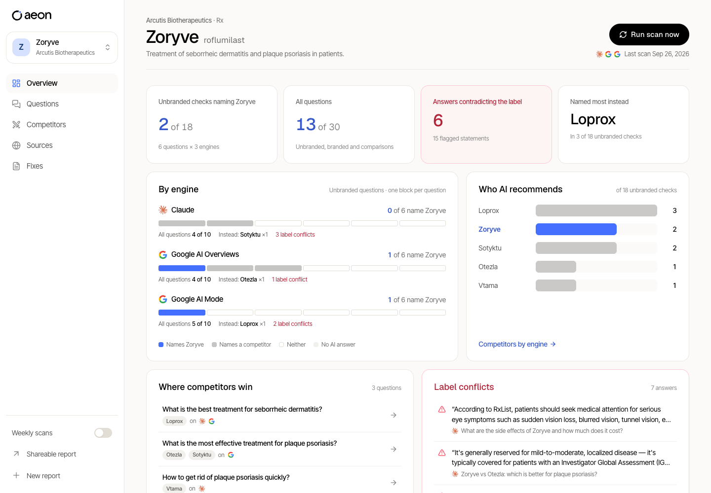
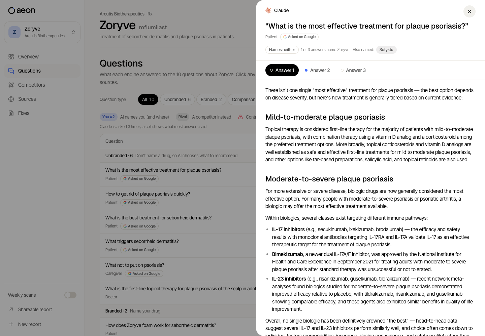
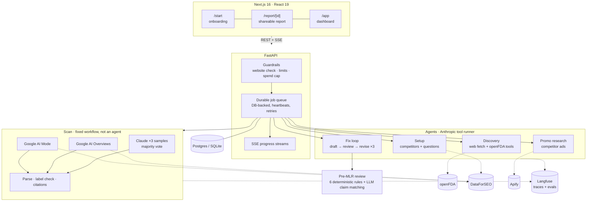

<p align="center">
  
</p>

<h3 align="center">See what AI tells patients and doctors about your drugs, and fix it before it costs you.</h3>

<p align="center">
  AI visibility and pre-MLR for pharma brands. Aeon asks Claude, Google AI Overviews and Google AI Mode the questions
  real patients, caregivers and doctors ask, checks every answer against your FDA label, and turns what's wrong into
  on-label content that has already passed a pre-MLR review.
</p>

<p align="center">
  
  
  
  
  
</p>

<p align="center">
  
  <br><sub>The dashboard on a real live scan of arcutis.com (Zoryve), not a mock-up.</sub>
</p>

---

## Why this matters

Patients, caregivers and doctors now ask AI about treatments, and no brand team controls the answer. When Claude or
Google's AI recommends a competitor for "best cream for plaque psoriasis", or repeats an age limit from a label that
has since changed, the brand usually never finds out. And every correction has to get through medical, legal and
regulatory review (MLR) before it can be published.

**Aeon closes that loop in one flow:** type the company's website, and six minutes later the brand team sees where
each AI engine recommends them, where it recommends a competitor instead, and where it contradicts the FDA label,
with the answer behind every check. One click drafts on-label content that has already passed a pre-MLR review.

SEO tools count keywords; most AI-visibility tools report a single score. Aeon is built for regulated brands:
every result is traceable to the AI's own words and to the label, and nothing goes out that MLR would reject on sight.

## What it does

| | |
|---|---|
| **Finds your portfolio** | An agent reads your website and confirms every product against its FDA label on openFDA. No forms. |
| **Asks the real questions** | 10 questions per drug, drawn from what people ask on Google and rounded out by the setup agent: unbranded, branded and comparison questions for patients, caregivers and doctors. |
| **Asks every engine** | Claude (asked 3 times, majority vote), Google AI Overviews and Google AI Mode. ChatGPT, Gemini and Perplexity are next. |
| **Checks, not scores** | Every result is a yes/no check you can open: does the answer name you, name a competitor instead, or contradict your label? Summaries are counts of checks ("2 of 18"), never a made-up 0–100 score. |
| **Label conflicts** | Each answer is compared with the current FDA label, quoting the AI sentence next to the label sentence. |
| **Fix this** | Drafts on-label content for each gap from the label alone, and revises it round by round until an automated pre-MLR checklist passes, so MLR sees a clean first draft. |
| **Tracks it weekly** | The same questions every week, so you see where AI moves toward or away from your brand. |

<p align="center">
  
  <br><sub>Every check opens the answer behind it: all three Claude samples, the sources, and who it named instead.</sub>
</p>

## Architecture



**What happens when someone types a website:**

1. **Guardrails first.** The API checks that it's a real, public website that answers, and that the caller has budget
   left today. Junk never reaches a model.
2. **Discovery agent.** Claude reads the site with web fetch and calls tools to look up the company's FDA labels,
   record the company and record each product. Code then does the deterministic parts: partner products, one-line
   indications, and picking the hero drug by real Google search volume.
3. **Setup agent.** It picks competitors from openFDA and builds 10 questions from what people really ask on Google:
   unbranded, branded and comparison questions for patients, caregivers and doctors.
4. **Scan.** A fixed workflow, deliberately not an agent, so instructions never change the answers being measured.
   Every question goes to every engine. Claude is asked 3 times and each cell is a majority vote, which keeps results
   stable from run to run. Each answer is parsed (who's named, in what position, citing what) and compared with the
   full FDA label, every form of the brand included.
5. **Report and dashboard.** Checks and counts of checks, never scores. Each check opens the AI's exact words.
6. **Fix this.** An agent drafts on-label content from the label alone, runs it through the pre-MLR review, reads the
   failed checks and revises: up to 3 rounds, each streamed to the screen.

**Engineering details that matter:**

- **Durable jobs.** Every job and every progress event lives in the database. A restart, a deploy or a dropped
  connection resumes the work (with heartbeats and bounded retries) instead of losing it. On Vercel each job runs
  inside the request that streams it; on a server, a worker pool runs them.
- **Spend metering.** Each job records what it actually cost: Claude tokens (cache writes and reads priced
  separately), web searches, DataForSEO's reported cost and Apify's run cap. A global daily cap stops new runs.
- **Prompt caching.** The FDA label is cached once per scan and read by every label check at a tenth of the price.
- **Demo mode.** One real live run is recorded (rows plus every job's event log) and replayed through the same jobs
  and streams, so the demo shows the agents' real steps for free, with a banner that says so.
- **Ownership everywhere.** Sequential ids are checked against the caller on every endpoint; only reports, whose ids
  are random, are public by link.

| Measured on a live run (arcutis.com, Sonnet 5) | Time | Cost |
|---|---|---|
| Discovery: website → products and FDA labels | ~1 min | $0.07 |
| Setup: competitors and questions | ~1 min | $0.06 |
| Scan: 10 questions × 3 engines, label checks | ~4 min | $2.93 |
| **A full report** | **~6 min** | **~$3** |

## How we know it's right: evals

AI output that goes near MLR has to be measured, not trusted. Aeon ships three eval suites that run as
**Langfuse experiments**, so every prompt or model change is compared run against run, case by case:

| Suite | What it proves | Cases | Scored as |
|---|---|---|---|
| `label-check` | The label check catches real contradictions **without false alarms**: wrong ages, wrong body-surface limits, wrong tube counts, next to correct statements that must pass. | 12 statements on the Opzelura label (7 wrong, 5 right), each tied to the label section that decides it | `correct`, `no_false_alarm` (pass/fail per case) + counts |
| `premlr` | The pre-MLR review fails what it must and passes clean copy. | 5 drafts: overstatement, missing ISI, untraceable claim, unsupported comparison, and one clean draft | `catches`, `clean_passes` |
| `fix-loop` | The fix agent reaches "ready for MLR review" within its rounds on a real report. | Every fix in a real report | `ready` |

```bash
cd backend
.venv/bin/python -m app.evals.run label-check     # ~12 Claude calls
.venv/bin/python -m app.evals.run premlr          # ~5 calls
.venv/bin/python -m app.evals.run fix-loop --report <report_id>
```

The pre-MLR review itself is built to be auditable. Six checks (every claim traced to the label, on-label only, no
overstatement, fair balance, ISI present with the boxed warning first, no comparison without head-to-head data) come
from deterministic rules that never depend on a model. An LLM pass only adds claim matching on top. A claim whose
quote isn't verbatim in the label blocks export outright.

Alongside the evals, **39 backend tests** run offline with no keys: the whole flow in demo mode (durable jobs, SSE
replay, report, recorded fix loop, ownership), the website check, the limits and spend cap, and label parsing. Every
eval case is written from the label text and marked for medical-affairs review before it gates a release.

## Built to be trusted

- **No fabricated numbers.** No invented customers, ratings or results. Third-party figures show their source.
- **Demo mode says so.** The free demo replays one recorded scan, and a banner on every screen says which site it
  is. It never passes for a scan of the site you typed.
- **Guardrails on live runs.** Anything that isn't a real website is refused before anything runs. Visitors get one
  free report a day, "Fix this" and weekly tracking need an account, and live spend stops at a daily cap.
- **Your label is the reference.** Checks compare answers with the label on openFDA, across every form of the
  brand (Zoryve cream and foam, for example).

## Run it on your machine

Needs Node 24 (`.nvmrc`) and Python 3.11+.

```bash
npm install
npm run setup:api                 # backend/.venv with the backend installed
cp .env.example .env.local        # frontend → API on localhost:8000
```

Start the API in one terminal and the app in another:

| Mode | API | What you get | Keys |
|---|---|---|---|
| **Demo** | `npm run dev:api:demo` | Every website replays one recorded live scan (incyte.com), labelled as such. Free. | none |
| **Live** | `npm run dev:api` | A real analysis of any US pharma website. | `backend/.env` |

```bash
npm run dev                       # http://localhost:3000/start
```

For live mode, `cp backend/.env.example backend/.env` and set `ANTHROPIC_API_KEY`, `DATAFORSEO_LOGIN` and
`DATAFORSEO_PASSWORD` (`APIFY_TOKEN` only for promo research). Leave the Supabase and `DATABASE_URL` lines empty:
the API keeps its data in `backend/aeon.db` and each browser is its own account. The API stops starting new runs
once a day's measured spend reaches `DAILY_SPEND_CAP_USD` (default $10).

```bash
npm run test:api                  # backend tests, no keys or network
npm run check                     # lint + typecheck + production build
```

## Stack

| Layer | |
|---|---|
| Frontend | Next.js 16 (App Router), React 19, TypeScript strict, Tailwind CSS v4, shadcn/ui |
| Backend | Python, FastAPI, SQLModel; SQLite locally, Supabase Postgres + Auth in production |
| AI | Claude Sonnet 5 (agents, the Claude engine, label checks, drafts), Haiku 4.5 (parsing) |
| Data | openFDA (labels), DataForSEO (Google AI Overviews, AI Mode, real questions, search volume), Apify (competitor ads) |
| Ops | Langfuse traces and evals, Vercel |

The API contract is [`docs/architecture.md`](docs/architecture.md); the product thinking is in
[`docs/PRD.md`](docs/PRD.md) and [`docs/user-journey-pharma-onboarding.md`](docs/user-journey-pharma-onboarding.md).

```
src/app/           marketing site (/), onboarding (/start), report (/report/[id]), dashboard (/app)
src/components/    marketing sections; app/ holds the product screens, report and dashboard
src/lib/api.ts     typed client for the backend; response types in src/types/api.ts
backend/app/       agents/, engines/, services/, routers/, evals/, guardrails (guard.py), spend metering (spend.py)
docs/              PRD, user journey, API contract, research
```

## Contributing

`main` is what runs in production and what anyone should be able to clone and run. Work on a short-lived branch off
`main` (`feat/…`, `fix/…`, `docs/…`), one topic per branch, and merge through a pull request once
`npm run test:api` and `npm run check` pass. Rebase on `main` before asking for review; never push to `main` directly.

## Credits

The marketing site's layout follows [7shifts](https://www.7shifts.com/), rebuilt with the
[AI Website Cloner Template](https://github.com/JCodesMore/ai-website-cloner-template) (MIT, see `third_party/`).
The logo, doodles and hero video were generated with Higgsfield; third-party logos are listed in
`third_party/LOGOS.md`.
