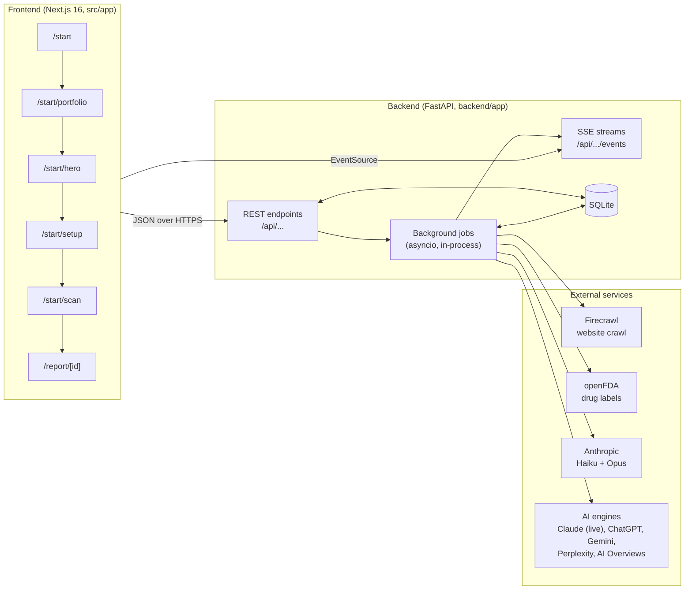
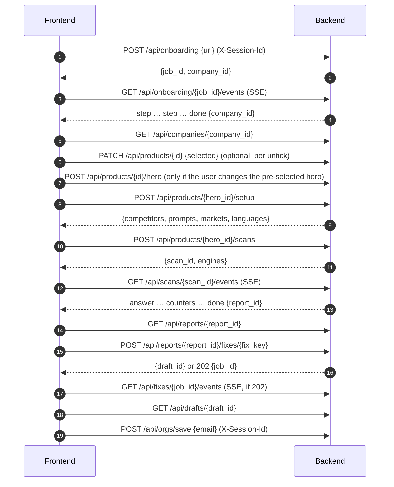
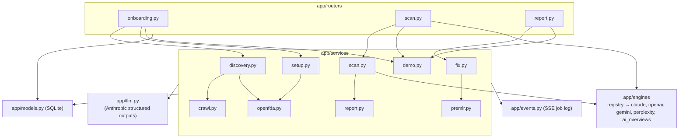

# Architecture: frontend ↔ backend

Sep 26, 2026

How the frontend screens from `user-journey-pharma-onboarding.md` connect to the backend in `backend/`. This page is for both teams: the contract, the call order per screen, the live progress streams, and the rules for errors and reconnects. For the full field list of every endpoint, run the backend and open `/docs`.

## System overview



- The frontend talks only to the backend. It never calls Firecrawl, openFDA, Anthropic or the engines, and never holds API keys.
- Long work (discovery, scan, "Fix this") runs as **background jobs**. The frontend starts a job with a `POST` and follows its progress on an **SSE stream**.
- Every result is also saved in the database, so a finished page can always be rebuilt with plain `GET` calls.

## Connection basics

| Item | Value |
|---|---|
| Base URL | `http://localhost:8000` locally. Put it in one frontend env var, e.g. `NEXT_PUBLIC_API_URL`. |
| Format | JSON in and out. `Content-Type: application/json` on bodies. |
| CORS | Open (`*`) for the hackathon. Restrict in `app/config.py` (`cors_origins`) before going public. |
| Session | Generate a UUID once per browser, keep it in `localStorage`, and send it as `X-Session-Id`. Required on `POST /api/onboarding` and `POST /api/orgs/save`; harmless elsewhere. |
| Auth | None in the MVP. IDs in URLs are the only access control, so the report link is shareable by design. |
| Errors | Non-2xx responses return `{"detail": "..."}`. Show `detail` to the user. |
| Live docs | `GET /docs` (interactive) and `GET /openapi.json` (can generate a typed client). |
| Health | `GET /api/health` → `{"ok": true, "demo_mode": false}`; in demo mode also `demo_domain`, the site the recording is of |

**Demo mode.** Start the backend with `DEMO_MODE=1` and any URL replays a recorded incyte.com run (Opzelura as the hero drug) through the same endpoints and streams, in a few seconds. The frontend doesn't change. Use it for development and as the fallback when showing the product.

## Screen-by-screen flow



### Screen 1: `/start` ("How does AI talk about your drugs?")

1. `POST /api/onboarding` with `{"url": "incyte.com"}` → `{"job_id": "discovery-5", "company_id": 5}`
2. Open `GET /api/onboarding/{job_id}/events` and show each `step` event as a checklist row. Rows are keyed by `key`: an `active` event shows a spinner, a `done` event with the same key ticks it.
3. On `done`, go to `/start/portfolio?company={company_id}`. On `error`, show `message` with a retry button.

Live timing: ~22s. Demo mode: ~3s.

### Screen 2: `/start/portfolio` ("Here's what we found")

- `GET /api/companies/{id}` returns the company card fields plus `products[]`, sorted with approved products first.
- Card rules:

| Product field | UI |
|---|---|
| `label_found` | Green "FDA label found" badge |
| `tier` | "Rx" or "OTC" |
| `indication` | One-line indication |
| `partner: true` | Show "Labeled by {labeler}" and start unticked. Can't be the hero. |
| `pipeline: true` | Show in a "Pipeline" group, unticked, not scanned |
| `has_boxed_warning` | Optional warning icon |

- If `labeler_candidates` has 2 or more names, ask "Which of these are you?" and send the answer to `POST /api/companies/{id}/labeler` with `{"labeler": "..."}`. It returns the updated company: other labelers' products become partner products, the hero moves if it has to, and `labeler_candidates` is cleared.
- Untick or retick: `PATCH /api/products/{id}` with `{"selected": false}`.
- "Add a product": `POST /api/companies/{id}/products` with `{"brand": "Dupixent"}`. Returns the new product, or 404 if no US FDA label exists.
- Primary button "Looks right" → `/start/hero`.

### Screen 3: `/start/hero` ("Which drug should we start with?")

- Reuse the company response. The pre-selected card is the product with `is_hero: true`.
- If the user picks another product, call `POST /api/products/{id}/hero`. Only offer products where `selected && !partner && !pipeline`.

### Screen 4: `/start/setup` ("Who you're up against and what people ask")

- `POST /api/products/{hero_id}/setup` → `{competitors[], prompts[], markets: ["US"], languages: ["en"]}`.
  - Takes ~15s the first time (show a loading state). Returns instantly after that: it is idempotent. Add `?regenerate=true` to rebuild.
  - Tip: call it in the background as soon as the hero is known (end of screen 3), so the screen is ready when the user arrives.
- Competitor chips: remove with `DELETE /api/competitors/{id}`; add with `POST /api/products/{hero_id}/competitors` and `{"brand": "...", "molecule": ""}`.
- Questions: show 20 grouped by `audience` (`patient`, `caregiver`, `hcp`) and a "+20 more" counter. To save edits, `PUT /api/products/{hero_id}/prompts` with the full list `[{text, audience}]` (it replaces the whole set).
- Never show `lane`. The API leaves it out of this screen on purpose.
- Primary button "Run my first scan" → `POST /api/products/{hero_id}/scans`, then go to `/start/scan?scan={scan_id}`.

### Screen 5: `/start/scan` (live scan)

- `POST /api/products/{hero_id}/scans` → `{"scan_id": 6, "engines": ["claude"]}`. Returns `409` if setup hasn't run, `503` if no engine is configured.
- Grid: rows are the prompts from screen 4, columns come from `GET /api/engines`. Show disabled engines greyed out ("coming soon").
- Open `GET /api/scans/{scan_id}/events`:
  - `answer`: fill one cell `(prompt_id, engine)`. Suggested cell states: mentioned (green), competitor recommended instead (red), accuracy issue (warning icon), `error` (grey).
  - `counters`: update the header counters (`answers / total`, `mentions`, `competitor_mentions`, `accuracy_issues`).
  - `done`: go to `/report/{report_id}`.
- Live timing: ~2m 50s for 40 prompts on one engine. Demo mode: ~5s.
- "Email me when ready" isn't built yet.

### Screen 6: `/report/[id]` ("Your AI visibility report")

`GET /api/reports/{id}` needs no session header, so this is the shareable link. Map the fields to the sections of the journey doc:

| Report section | Field |
|---|---|
| 1. Headline number | `headline.you.score` vs `headline.top_competitor.brand` / `.score`. Show `n` and `ci95` in small print. |
| 2. Red box | `accuracy_issues[]`, sorted high → low severity. Show `ai_sentence` next to `label_sentence`. |
| 3. Where you lose | `lost_prompts[]` (up to 3): `prompt`, `competitors`, `engines_lost` |
| 4. Why | `competitor_only_sources[]`: `domain`, `citations`, `competitors` |
| 5. Top 3 fixes | `fixes[]`: `key`, `title`, `why`, `kind`. Each gets a "Fix this" button. |
| Detail views | `competitors{}` (per-competitor scores), `engines{}`, `grid[]`, `prompts[]`, `methodology` |
| Full answer text | `GET /api/reports/{id}/answers?prompt_id=…&engine=…` |

The headline measures **unbranded questions only** (`headline.scope`), where AI chooses what to recommend. The all-questions score is in `all_prompts` and is always higher, because branded questions name the drug.

**"Fix this" button:**

1. `POST /api/reports/{id}/fixes/{fix_key}`
   - `200 {"draft_id": 11, "job_id": null}`: the draft exists (or demo mode). Go to step 3.
   - `202 {"draft_id": null, "job_id": "fix-…"}`: drafting started (~1 min live).
2. Open `GET /api/fixes/{job_id}/events`: `step` ("Drafting from the FDA label…", "Running pre-MLR checks…"), then `done {draft_id}` or `error {message}`.
3. `GET /api/drafts/{draft_id}` → `title`, `content_md` (render as Markdown), `claims[]` (claim ↔ label quote table), and `premlr`:

| `premlr` field | UI |
|---|---|
| `risk_score` (0–100), `risk_level` (`low` / `medium` / `high`) | Risk badge |
| `blocked: true` | "Blocked: unreferenced claims" banner. Don't offer export. |
| `fast_track: true` | "Fast-track eligible" tag |
| `flags[]` | Per-flag list: `excerpt` (highlight it in the draft), `rule`, `severity`, `suggestion`, `source` (`rule` or `ai`) |

A double click on "Fix this" is safe: it joins the running job.

**Save gate:** `POST /api/orgs/save` with `{"email": "..."}` and the `X-Session-Id` header. Stores the email only (no password or sign-in yet).

## Live progress (SSE) contract

Three streams, all with the same shape:

| Stream | Started by | Events | Ends with |
|---|---|---|---|
| `GET /api/onboarding/{job_id}/events` | `POST /api/onboarding` | `step {key, label, status: "active" \| "done", pages?, count?}` | `done {company_id}` or `error {message}` |
| `GET /api/scans/{scan_id}/events` | `POST /api/products/{id}/scans` | `answer {prompt_id, engine, mentioned, position, competitors_mentioned[], accuracy_issues (count), error}`, `counters {answers, total, mentions, competitor_mentions, accuracy_issues, errors}` | `done {report_id}` or `error {message}` |
| `GET /api/fixes/{job_id}/events` | `POST /api/reports/{id}/fixes/{key}` (202) | `step {key, label}` | `done {draft_id}` or `error {message}` |

Rules:

- **History replays.** Connecting late (or twice) sends every past event from the start, then continues live. It's safe to open the stream right after the `POST`, or after a page refresh.
- **Close the stream on `done` or `error`.** Otherwise the browser's `EventSource` reconnects on its own and replays the whole history.
- **The `data` is JSON.** Parse it with `JSON.parse(e.data)`.
- **`error` has two meanings.** The server's `error` event carries `{message}`. The browser also fires `error` with no data when the connection drops; it reconnects on its own, so ignore those.
- **404 on a stream** means the server restarted and the in-memory job is gone. Fall back to polling (below).

```ts
function follow(path: string, handlers: Record<string, (data: any) => void>) {
  const es = new EventSource(`${API}${path}`);
  for (const [event, fn] of Object.entries(handlers)) {
    es.addEventListener(event, (e) => {
      const data = (e as MessageEvent).data;
      if (data !== undefined) fn(JSON.parse(data)); // skip the browser's own connection errors
    });
  }
  const close = () => es.close();
  es.addEventListener("done", close);
  es.addEventListener("error", (e) => {
    // A server-sent `error` event has data; a network error doesn't.
    if ((e as MessageEvent).data) close();
  });
  return close;
}

follow(`/api/scans/${scanId}/events`, {
  answer: (a) => fillCell(a.prompt_id, a.engine, a),
  counters: (c) => setCounters(c),
  done: ({ report_id }) => router.push(`/report/${report_id}`),
  error: ({ message }) => showError(message),
});
```

### Polling fallback

If a stream returns 404, or the user comes back to a page later:

| Job | Poll | Finished when |
|---|---|---|
| Discovery | `GET /api/companies/{id}` | `status` is `ready` (or `failed`) |
| Scan | `GET /api/scans/{id}` | `status` is `done` (then use `report_id`) or `failed` |
| Fix | `POST /api/reports/{id}/fixes/{key}` again | Response has a `draft_id` (it restarts drafting if it was lost) |

Every 3 seconds is enough.

## Endpoint reference

| Method | Path | Body | Returns |
|---|---|---|---|
| GET | `/api/health` | | `{ok, demo_mode}` |
| GET | `/api/engines` | | `[{name, label, enabled}]` |
| POST | `/api/onboarding` | `{url}` + `X-Session-Id` | `{job_id, company_id}` |
| GET | `/api/onboarding/{job_id}/events` | | SSE |
| GET | `/api/companies/{id}` | | company + `products[]` |
| POST | `/api/companies/{id}/products` | `{brand}` | product, or 404 |
| GET | `/api/products/{id}` | | product incl. full `label` |
| POST | `/api/companies/{id}/labeler` | `{labeler}` | company + `products[]`; 422 if not a candidate |
| PATCH | `/api/products/{id}` | `{selected}` | `{ok}` |
| POST | `/api/products/{id}/hero` | | `{ok}` |
| POST | `/api/products/{id}/setup` | `?regenerate=true` optional | setup view |
| GET | `/api/products/{id}/setup` | | setup view |
| POST | `/api/products/{id}/competitors` | `{brand, molecule?}` | competitor |
| DELETE | `/api/competitors/{id}` | | `{ok}` |
| PUT | `/api/products/{id}/prompts` | `[{text, audience?, lane?}]` | setup view |
| POST | `/api/products/{id}/scans` | | `{scan_id, engines}`; 409 / 503 |
| GET | `/api/scans/{id}` | | scan `{status, stats, report_id, engines, started_at, finished_at}` |
| GET | `/api/scans/{id}/events` | | SSE |
| GET | `/api/reports/{id}` | | report |
| GET | `/api/reports/{id}/answers` | `?prompt_id&engine` optional | `[answer]` with full `text` and `citations` |
| POST | `/api/reports/{id}/fixes/{key}` | | 200 `{draft_id}` or 202 `{job_id}` |
| GET | `/api/fixes/{job_id}/events` | | SSE |
| GET | `/api/drafts/{id}` | | draft |
| POST | `/api/orgs/save` | `{email}` + `X-Session-Id` | `{ok, org_id, email}` |

### Sample shapes (from the recorded demo)

Product card (`GET /api/companies/{id}` → `products[i]`):

```json
{
  "id": 53, "company_id": 5, "brand": "Jakafi", "molecule": "ruxolitinib", "tier": "Rx",
  "indication": "JAK inhibitor for myelofibrosis, polycythemia vera, and graft-versus-host disease",
  "url": "https://www.jakafi.com/", "labeler": "Incyte Corporation", "label_set_id": "f1c82580-…",
  "selected": true, "is_hero": false, "partner": false, "pipeline": false, "search_rank": 1,
  "label_found": true, "has_boxed_warning": false
}
```

Report headline:

```json
{
  "scope": "unbranded",
  "you": {"score": 69, "mentions": 9, "n": 13, "ci95": [42, 87]},
  "top_competitor": {"brand": "Protopic", "score": 62, "mentions": 8, "n": 13, "ci95": [36, 82]}
}
```

Accuracy issue (`accuracy_issues[i]`):

```json
{
  "type": "indication", "severity": "high",
  "ai_sentence": "…approved for 12+, so not an option at 4.",
  "label_sentence": "OPZELURA is indicated for … pediatric patients 2 years of age and older …",
  "explanation": "…", "engine": "claude", "prompt": "…"
}
```

Lost prompt, source and fix:

```json
{"prompt_id": 132, "prompt": "Can eczema be cured or is it just managed long-term?", "audience": "patient", "engines_lost": 1, "competitors": ["Dupixent"]}
{"domain": "dermatologytimes.com", "citations": 2, "competitors": ["Dupixent", "Elidel", "Protopic"]}
{"key": "ad-age-2-plus", "title": "Correct the atopic dermatitis age range: …", "why": "…", "kind": "accuracy_correction", "target_prompts": ["…"]}
```

`kind` is one of `accuracy_correction`, `on_page_content`, `faq`, `off_page`.

Draft (`GET /api/drafts/{id}`, shortened):

```json
{
  "id": 11, "report_id": "d8ca…", "fix_key": "ad-age-2-plus",
  "title": "Opzelura (ruxolitinib) cream: Approved Down to Age 2 …",
  "content_md": "## Direct answer\n\n…",
  "claims": [{"text": "…", "label_section": "indications", "label_quote": "OPZELURA is indicated for …"}],
  "premlr": {
    "risk_score": 51, "risk_level": "high", "blocked": false, "fast_track": false,
    "flags": [{"excerpt": "**Is OPZELURA \"safe\" for children?**", "rule": "overstatement", "severity": "high",
               "suggestion": "…", "source": "rule"}]
  }
}
```

Enum values:

| Field | Values |
|---|---|
| `audience` | `patient`, `caregiver`, `hcp` |
| `tier` | `Rx`, `OTC` |
| `company.status` | `discovering`, `ready`, `failed` |
| `scan.status` | `running`, `done`, `failed` |
| `accuracy type` | `dose`, `indication`, `boxed_warning`, `contraindication`, `other` |
| `severity`, `risk_level` | `high`, `medium`, `low` |
| `premlr rule` | `unsupported_claim`, `off_label`, `fair_balance`, `overstatement`, `missing_isi`, `other` |

## Backend internals (for backend work)



| Concern | Where |
|---|---|
| Settings: models, effort levels, concurrency, CORS | `app/config.py` |
| Tables: Org, Company, Product, Competitor, Prompt, Scan, Answer, Report, Draft | `app/models.py` |
| Job log and SSE replay | `app/events.py` |
| Adding an AI engine | New class in `app/engines/` with `name`, `label`, `enabled()` and `ask(prompt)`; add it to `registry.py` |
| Recording the demo | `python -m app.scripts.record_demo incyte.com --hero Opzelura` |

Data flow in one line: `Company` → `Product` (+ FDA label JSON) → `Competitor` + `Prompt` → `Scan` → `Answer` (one per prompt × engine) → `Report` (a snapshot of the numbers and fixes) → `Draft` (+ pre-MLR result).

## Known limits that affect the frontend

- **Server restarts** drop in-flight jobs (streams return 404). Use the polling fallback; results already saved are safe.
- **Single process.** Jobs run inside the web server. Run one backend instance; don't load-balance across several.
- **No auth or anonymous limits** yet. Anyone with an ID can read its data, and scans aren't rate-limited per session.
- **Firecrawl free plan** allows about 2 onboardings per minute. A burst returns slower discovery (the backend retries).
- **Not built yet:** "Email me when ready" and "Add your other products". The role question on the report is frontend-only (stored per browser). See `progress-backend.md`.
- **`PUT /api/products/{id}/prompts` drops lanes.** The setup view hides `lane`, so a round-trip through this endpoint resets every question to `unbranded` and breaks the headline scope. The frontend doesn't edit questions until this keeps lanes.
