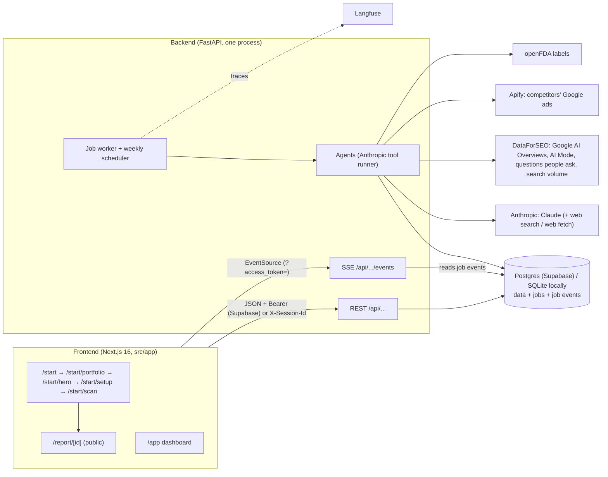
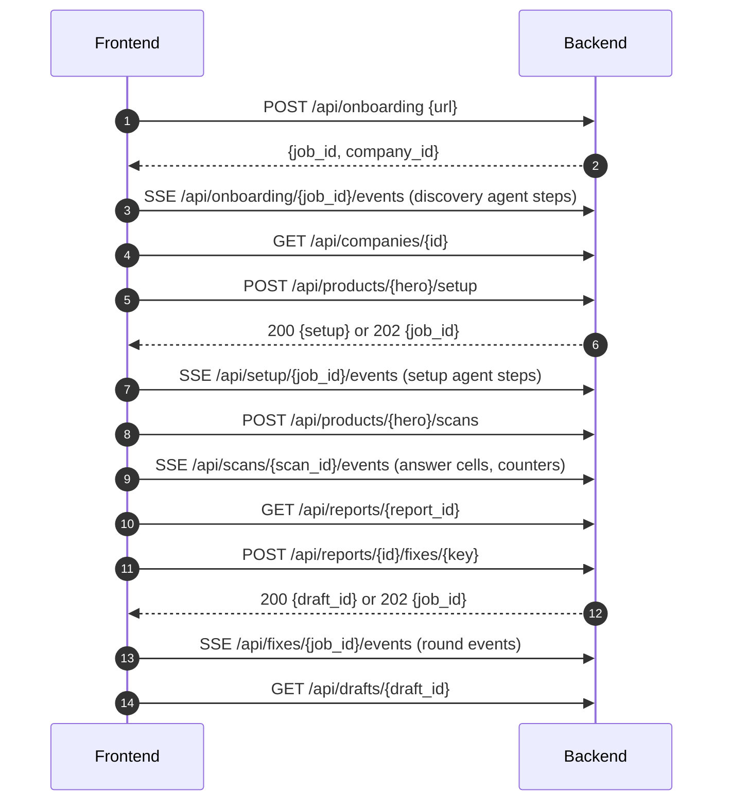
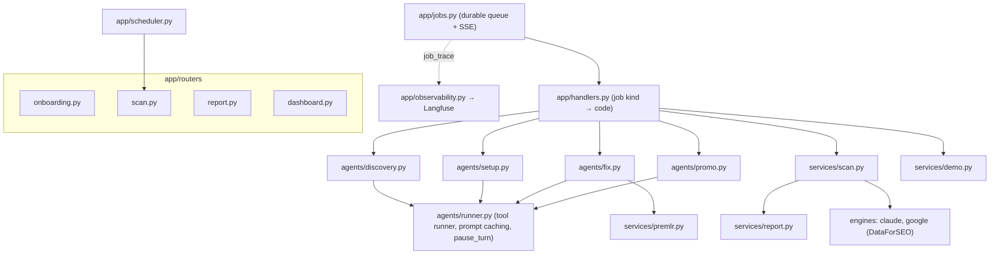

# Architecture: frontend ↔ backend (v2, agentic)

Sep 26, 2026

How the product screens (`docs/user-journey-pharma-onboarding.md`) connect to the backend in `backend/`. For both teams: the moving parts, the call order per screen, the live progress streams, and the rules for errors and reconnects. For the full field list, run the backend and open `/docs`; response shapes are typed by hand in `src/types/api.ts` (the OpenAPI spec has no response schemas yet).

## System overview



- The browser talks only to the backend and never holds API keys.
- **Durable jobs.** Long work (discovery, setup, scan, "Fix this", promo research) runs as jobs stored in the database. A `POST` starts one; progress arrives on an SSE stream that reads the job's event log from the database. After a restart the worker re-queues unfinished jobs and they run again from the start (handlers are idempotent), and the streams replay from the database. Nothing lives only in memory.
- **Agents** run on the Anthropic SDK's tool runner (`backend/app/agents/`): Claude picks the next tool call until the job is done. Each tool call streams to the UI as a step.
- **Checks, not scores.** Every result is a yes/no check or a count of checks. There are no percentages and no risk score.

## Connection basics

| Item | Value |
|---|---|
| Base URL | `NEXT_PUBLIC_API_URL`, default `http://localhost:8000` |
| Identity | With Supabase configured (`health.auth`): `Authorization: Bearer <access token>`. The browser signs in anonymously on its first visit, and the save gate adds an email to the same user. Without Supabase (demo, local): `X-Session-Id: <uuid per browser>`. The frontend sends it on every call (`src/lib/auth.ts`). |
| SSE auth | EventSource can't send headers: pass `?access_token=` (`streamUrl()` does it). Without auth, job ids are unguessable UUIDs, or scoped ids checked against the owner. |
| Ownership | Every endpoint except reports checks that the row belongs to the caller (404 otherwise). Reports are public by their random UUID: the report link is the share link. |
| Errors | Non-2xx returns `{"detail": "..."}`; show `detail`. |
| Health | `GET /api/health` → `{ok, demo_mode, auth, demo_domain?}` |

**Demo mode** (`DEMO_MODE=1`, `npm run dev:api:demo`): any website replays one recorded live run (`backend/fixtures/demo/bundle.json`) through the same jobs and events: the agents' real steps, the scan's cells, the fix loop's rounds. The frontend shows a banner naming the recorded site. Record a new bundle after a live run with `python -m app.scripts.record_demo --company <id>`.

## Screen-by-screen flow



| Screen | Calls |
|---|---|
| 1 `/start` | `POST /api/onboarding {url}`, then follow `step` events. Each step is one agent action ("Reading incyte.com/…", "Opzelura: FDA label found"). On `done`, go to portfolio. |
| 2 `/start/portfolio` | `GET /api/companies/{id}`; `PATCH /api/products/{id} {selected}`; `POST /api/companies/{id}/products {brand}` (404 if no US label); `POST /api/companies/{id}/labeler {labeler}` when `labeler_candidates` has 2+. |
| 3 `/start/hero` | Pre-selected hero = most Google searches for the brand (DataForSEO). `POST /api/products/{id}/hero`. Start setup in the background here (`src/lib/setup-cache.ts`). |
| 4 `/start/setup` | `POST /api/products/{id}/setup` → 200 `{setup}` or 202 `{job_id}` → `step` events → `GET /api/products/{id}/setup`. Competitors: `POST /api/products/{id}/competitors`, `DELETE /api/competitors/{id}`. The 10 questions have `kind` (`unbranded` / `branded` / `comparison`) and `source` (`google_paa` = asked on Google). |
| 5 `/start/scan` | `POST /api/products/{id}/scans` → `{scan_id, engines}`; `GET /api/engines` for columns (`coming_soon` engines are greyed); `answer` events carry one cell each (see Cells); `counters`; `done {report_id}`. |
| 6 `/report/[id]` | `GET /api/reports/{id}` (public); `GET /api/reports/{id}/answers?prompt_id&engine` (every sample); "Fix this": `POST /api/reports/{id}/fixes/{key}`. |
| Fix | 202 → `/api/fixes/{job_id}/events`: `step` and `round {round, status, failed[]}` events, then `done {draft_id}` → `GET /api/drafts/{id}` (owner) or `GET /api/reports/{id}/drafts/{key}` (public with the report). |
| Save | Supabase `auth.updateUser({email})` (magic link) + `POST /api/orgs/save {email}`. |
| Dashboard | `GET /api/companies`, `/api/products/{id}/history`, `/scans`, `/tracking` (`PUT ?weekly=true`), `/opportunities` (`POST` starts the promo agent, events at `/api/promo/{job_id}/events`; `POST /opportunities/{key}/draft` drafts through the fix loop), `/drafts`. |

## Cells and checks

A cell is one question × engine, the majority vote over its samples (Claude is asked `claude_samples` = 3 times; Google engines once):

```json
{"state": "you", "votes": "2/3", "samples": 3, "mentioned": true, "position": 2,
 "competitors_mentioned": ["Protopic"], "label_conflict": false, "accuracy_issues": 0, "cites_you": false}
```

`state`: `you` (names the drug) · `competitor` (names a competitor, not you) · `none` · `not_shown` (Google showed no AI answer) · `error`.

## Report (v2)

| Field | What it is |
|---|---|
| `summary[engine]` | `unbranded` and `all` tallies `{asked, you, competitor, none, not_shown, error}`, `top_competitor {brand, count}`, `label_conflicts` |
| `questions[]` | `{id, text, audience, kind, source, cells: {engine: cell}}` |
| `competitors[]` | `{brand, by_engine: {engine: count on unbranded}, total}` |
| `accuracy_issues[]` | AI sentence vs label sentence, with `engine`, `sample`, `prompt` |
| `lost_questions[]` | Unbranded questions where an engine names a competitor and not you |
| `sources` | `competitor_only` (cited only in competitor answers: where to get content placed), `yours`, `by_competitor` |
| `changes` | Cells that changed since the previous scan of the same drug (`null` on the first) |
| `fixes[]` | 3 fixes `{key, title, why, kind, target_prompts}` |

## Pre-MLR checklist

A draft's `premlr` is `{status, blocked, checks[], flags[]}`. `status`: `ready` (every check passes) · `needs_changes` · `blocked` (a claim isn't traceable to the label: no export). The checks:

- Every claim traced to the label
- On-label only
- No overstatement
- Fair balance
- Important Safety Information present (boxed warning first)
- No comparison without head-to-head data

`rounds[]` records the fix loop: `{round, status, failed[]}`.

## Backend internals



| Concern | Where |
|---|---|
| Settings (models, effort, samples, rounds, keys) | `app/config.py`, `backend/.env` |
| Tables | `app/models.py` (plus `Job`, `JobEvent`, `Schedule`, `CompetitorAd`, `Opportunity`) |
| Accounts and ownership | `app/auth.py` |
| Tracing | `app/observability.py`: one Langfuse trace per job, agent/tool spans, Claude calls via OpenInference |
| Evals | `python -m app.evals.run label-check \| premlr \| fix-loop --report <id>` (Langfuse datasets + experiments) |

## Known limits

- One API process (worker and scheduler run inside it). Scale by moving the worker to its own process that shares the database.
- ChatGPT, Gemini and Perplexity are "coming soon" (DataForSEO LLM endpoints, no new vendor).
- The label check's precision needs medical-affairs review. Run the `label-check` eval before and after any prompt change.
- Competitors' Meta (Facebook/Instagram) ad copy is hidden from logged-out scrapers for Rx drugs; the promo agent uses Google's Ads Transparency Center instead.
