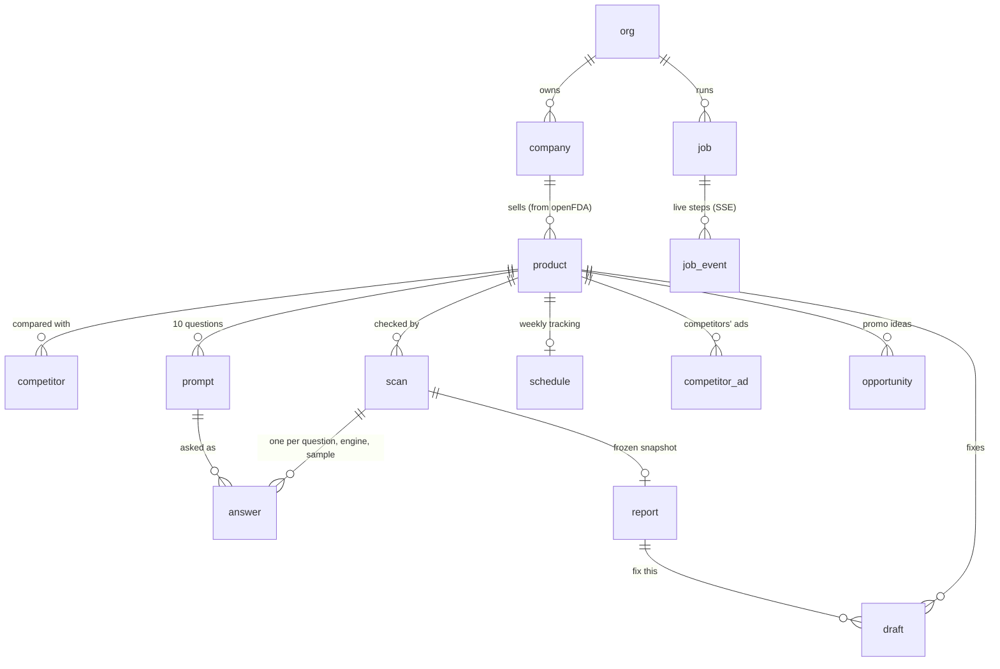

# Data model

How Aeon stores what it finds. The tables are defined in `backend/app/models.py`; this page explains why they look
the way they do and what to add next.

## Where the data lives

| Environment | Database | Why |
|---|---|---|
| Local dev and tests | SQLite (`backend/aeon.db`, empty `DATABASE_URL`) | Fast: a full demo run takes about 50 s, against about 166 s over the network to Supabase |
| Staging and production | Supabase Postgres, project `aeon` (eu-west-1) | Durable, backed up, shared by every API machine |

The backend is the only thing that talks to the database. It connects as the table owner through Supabase's session
pooler. Row Level Security is on for every table with no policies, so the browser's public anon key cannot read
anything through Supabase's REST API. The browser uses Supabase only to sign in.

Accounts: every visitor gets an anonymous Supabase user on their first visit. The backend maps that user to an `org`
row (`org.user_id`). When they add an email at the save gate, the same user and everything they made carries over.

## Tables

| Group | Tables | What they hold |
|---|---|---|
| Account | `org` | One per signed-in user (anonymous or with email) |
| Catalog | `company`, `product`, `competitor`, `prompt` | The brand, its FDA-labeled products, the competitors and the 10 questions for the hero product |
| Measurement | `scan`, `answer`, `report`, `schedule` | Each run of the questions across engines, every raw answer, the report built from them, and the weekly cadence |
| Output | `draft`, `competitor_ad`, `opportunity` | Fix-this drafts with their pre-MLR checklist and review rounds, competitors' ads, and on-label promo ideas |
| Jobs | `job`, `job_event` | Every agent run and the steps it streamed, so a page reload or an API restart picks up where it left off |

Table names are the class names in lowercase (`competitorad`, `jobevent` in the database).

## Rules the model follows

**Evidence first, checks computed.** An `answer` row keeps the raw answer text, its citations, and what was found in it
(brand mentioned, competitors named, label issues). The yes/no cells are computed from those rows when the report is
built: Claude is asked 3 times per question and each cell is the majority vote. No scores are stored anywhere.

**A report is a frozen snapshot.** `report.payload` holds everything the report page shows, as JSON, built once when the
scan finishes. A shared link keeps showing what the brand team saw, even after the questions or the label change. Its
id is a random UUID because the link is meant to be shared.

**Questions and competitors are retired, never deleted.** Answers point at the question they answered, and Postgres
enforces that link. Editing or regenerating the setup sets `active = false` on the old rows and adds new ones. Every
query for the current setup filters on `active`; a report lists the questions its own scan asked.

**Every check names its label.** `product.label_set_id` and `product.label_version` (openFDA's `effective_time`,
e.g. `20260630`) record which FDA label the answers were checked against. The report shows it with a DailyMed link:
an MLR reviewer can see exactly which label a finding refers to.

**Ownership runs through the product.** Every row reaches an `org` through `product → company → org`. Ids are
sequential, so every endpoint checks ownership (`app/auth.py`). Reports and their drafts are the only public reads.

**Jobs are durable.** `job` rows are the queue and `job_event` rows are the log. The live step lists and answer streams
in the UI read `job_event` rows, so nothing lives only in memory.

## Size

One scan asks 10 questions: 3 Claude samples, plus Google AI Overviews and AI Mode once each, so about 50 `answer` rows
and one `report`. Weekly tracking adds about 2,600 answers per product per year. Both databases handle that easily;
`job_event` is the table that grows fastest (one row per streamed step).

## Changing the schema

At startup the API runs `create_all()` (new tables) and then `add_missing_columns()` (`backend/app/db.py`), which adds
columns that models gained since a table was created, with their defaults. That covers additive changes. Renaming or
dropping a column, or changing its type, needs a real migration: adopt Alembic before the first customer.

## What to add next

In order of value:

1. **`label_version` table** (product, set id, version, sections, fetched at), with answers and reports pointing at a
   version id. Today `product.label` is copied once at discovery. A weekly job that checks openFDA for a newer version
   would flag reports checked against an old label, which is the audit trail MLR teams expect.
2. **`org_member`** (user, org, role) for teams. Today one org is one user.
3. **`answer_cell`** (scan, question, engine, state, votes) written when the report is built, and **`citation`**
   (answer, url, domain, owned). Trend charts per question and "most cited sources over time" then become simple
   queries instead of reading report JSON.
4. **JSONB and indexes on Postgres.** JSON columns are plain `json` today. Switch to `jsonb`, and index
   `answer.prompt_id` (per-question history) and `job.status` (the worker's queue query).
5. **Retention.** Prune `job_event` rows older than 30 days. Keep answers and reports: they are the brand's history.

RLS policies are only needed if the browser ever reads Supabase directly. Today every read goes through the API, which
checks ownership itself.
