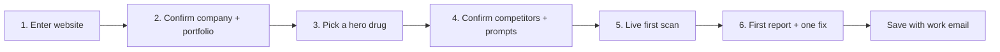

# PharmaPulse User Journey: Pharma Onboarding

Sep 26, 2026 · @Abdul Rehman Khan

## The goal

A pharma marketer types one thing, their company website, and sees how AI talks about their drugs in under 5 minutes. Everything else is inferred, shown back to them, and confirmed with a click.

This doc covers pharma manufacturers only (Rx, OTC, biotech). Pharmacies and telehealth are a separate discussion.

### Onboarding principles

1. **One input.** Company website URL. No forms about therapeutic areas, keywords or competitors.
2. **Confirm, don't configure.** AI proposes the portfolio, competitors and prompts; the user ticks or unticks. Nothing starts blank.
3. **Value before signup friction.** The first scan runs before we ask for billing, team invites or integrations.
4. **Scary number first.** The first screen after the scan shows one headline: "AI mentions you in 31% of answers; competitor X in 64%" or "2 AI answers state your dose wrong."
5. **Every screen has one primary button.** If a step needs explaining, it's too complicated.
6. **Defaults are pharma-safe.** Regulatory tier, lanes and guardrails are set automatically from the label; users never see the word "lane" during onboarding.
7. **Nothing is locked in.** Everything confirmed during onboarding is editable later from Settings.

## How PharmaGEO onboards today

PharmaGEO is sales-led: a prospect fills in a form and waits for a human. Their first value arrives in 24 hours at best and a full audit in 7 working days. We win by collapsing that into one self-serve session.

| Step | PharmaGEO | PharmaPulse |
| --- | --- | --- |
| Entry | Book a 30-minute demo, or request a free 8-page sample PDF ([contact page](https://pharma-geo.com/contact)) | Type your website, see results live |
| Inputs asked | Name, work email, company, role, brand or indication, markets and languages | Website URL (+ work email to save results) |
| First value | Sample report within 24 hours | First scan in under 5 minutes |
| Full audit | 7 working days, analyst-written ([comparison page](https://pharma-geo.com/articles/pharmageo-vs-generic-geo-tools)) | Same session, then refreshed weekly |
| Prompt set | Client's digital and medical teams build an 80-prompt set in week 1 ([90-day plan](https://pharma-geo.com/articles/90-day-pharma-geo-mobilization-plan)) | Auto-generated from the label; user just ticks |
| Next step | Analyst recommendations; client executes | "Fix this" button drafts the content and runs pre-MLR |

**Copy from them:** the free sample report as a lead magnet (ours is generated instantly and shareable), asking for markets and languages early, and a published methodology page.

**Skip:** mandatory demo calls, multi-field forms before any value, and asking the client to build their own prompt set.

**Keep a sales path too:** big pharma procurement will still want a demo. Offer "Book a walkthrough" as a secondary button, never as a gate.

## The journey at a glance

Six onboarding steps, about 5 minutes end to end, with only three clicks that need thought.

| Step | User does | Time | Feeling we want |
| --- | --- | --- | --- |
| 1. Enter website | Types `acmepharma.com` | 5 s | "That's it?" |
| 2. Confirm portfolio | Unticks anything wrong | 30 s | "It already knows us." |
| 3. Pick hero drug | Clicks one card | 5 s | "Start with what matters." |
| 4. Confirm competitors + prompts | Glances, clicks Run | 30 s | "These are the questions patients ask." |
| 5. Live scan | Watches the grid fill | 2–3 min | "This is live." |
| 6. First report | Reads headline, clicks one fix | 1 min | "Oh no. And oh, it fixes it." |

## Onboarding, screen by screen

### Screen 1 — "How does AI talk about your drugs?"

- **User sees:** landing page with one input: "Your company website" and a button "Scan my brands". Secondary link: "Book a walkthrough instead".
- **User does:** types the domain, presses Enter. No account yet.
- **Behind it:** crawl homepage, product pages, pipeline page and brand sites linked from the corporate site; look up the company as a labeler in openFDA.
- **While waiting (10–20 s):** a live checklist ticks off: "Reading your website… Found 7 products… Pulling FDA labels… Mapping indications…"

### Screen 2 — "Here's what we found"

- **User sees:** a company card (name, HQ, type: specialty pharma, therapeutic areas) and a grid of product cards. Each card: brand name, molecule, indication in one line, Rx or OTC, markets, and a green "FDA label found" badge.
- **User does:** unticks anything wrong (discontinued, divested, not theirs). "Add a product" if one is missing (type a brand name, we fetch the label).
- **Behind it:** product list merged from the website and openFDA records for that manufacturer; molecule and indication from the label; regulatory tier set automatically (Rx vs OTC).
- **Primary button:** "Looks right".

### Screen 3 — "Which drug should we start with?"

- **User sees:** the confirmed products as big cards, with one pre-selected (the brand with the most search demand).
- **User does:** clicks one. Copy says "You can add the rest in one click after your first scan."
- **Why one:** a focused first result is faster, cheaper and more memorable than a shallow scan of everything.

### Screen 4 — "Who you're up against and what people ask"

- **User sees:** two panels.
  - **Competitors:** 4–6 chips for drugs with the same indication (from openFDA + LLM), removable, with "+ add".
  - **Questions we'll ask AI:** 20 sample prompts grouped as Patients, Caregivers, Doctors, e.g. "What's the best treatment for moderate eczema in adults?" and "How is \[brand\] dosed?". A counter says "+20 more".
- **User does:** glances, maybe removes a competitor, clicks **Run my first scan**.
- **Behind it:** 40 prompts generated from the label and indication, each silently tagged with its lane (off-label prompts are monitor-only).
- **Optional, collapsed:** markets and languages (default: US, English).

### Screen 5 — Live scan

- **User sees:** the prompt × engine grid filling live across ChatGPT, Claude, Gemini, Perplexity and Google AI Overviews. Top counters tick up: answers read, mentions of you, mentions of competitors, accuracy issues found.
- **User does:** nothing; watches for 2–3 minutes. A button "Email me when ready" if they want to leave.
- **Behind it:** scan fan-out, answer parsing, accuracy check against the label, citation collection.

### Screen 6 — "Your AI visibility report"

- **User sees**, top to bottom:
  1. **Headline number:** visibility score vs top competitor ("You: 34. Competitor X: 71.").
  2. **Red box (if any):** accuracy issues, e.g. "2 AI answers state the wrong dose" with the AI sentence next to the label sentence.
  3. **Where you lose:** 3 prompts where a competitor is recommended and you're not.
  4. **Why:** top sources AI cites for your competitors that never mention you.
  5. **Top 3 fixes**, each with a "Fix this" button.
- **User does:** clicks one "Fix this" → sees a drafted, label-grounded page with a pre-MLR risk score, which proves the whole loop.
- **Save gate:** "Save this report and track weekly": work email + password (or Google/Microsoft sign-in). This is the first time we ask for an account.
- **Share:** "Share report" creates a link for their boss or medical affairs; the shared report is the viral loop.

## What we ask vs what we infer

We ask for two things: a website and, at the end, a work email. Everything else is inferred and shown back for confirmation.

| Information | How we get it | User's job |
| --- | --- | --- |
| Company name, HQ, type | Website crawl + LLM summary | None |
| Product portfolio | Website product pages + openFDA records by manufacturer | Untick wrong ones |
| Molecule (INN) per product | FDA label | None |
| Indications, population | FDA label | None |
| Rx vs OTC (regulatory tier) | FDA label product type | None |
| Boxed warning, dosing | FDA label | None |
| Brand websites | Links from corporate site + label | None |
| Competitors | Drugs with overlapping indications in openFDA + LLM | Remove or add a chip |
| Prompts | Generated from indication, label and audience | Glance |
| Keywords | Generated from prompts + DataForSEO suggestions | None (shown later in SEO tab) |
| Markets and languages | Default US/English; detect EU if the site has country selectors | Optional toggle |
| Work email | Asked at save | Type it |
| Team, integrations, billing | Asked after first value | Later |

## After onboarding

The goal of the first month is one approved, published fix with measured lift. That turns a curious user into a paying account.

| When | What happens | Nudge from us |
| --- | --- | --- |
| Day 0 | First report saved; one draft created | "Add your other 6 products" (one click, scans run in background) |
| Day 1 | Full scans done for the whole portfolio; SEO audit finished | Email: portfolio summary + top 3 actions |
| Days 2–5 | User invites medical affairs / regulatory reviewer to the pre-MLR workspace | In-app: "Your draft needs a reviewer. Invite one." |
| Week 1 | First weekly re-scan; trend line appears | Monday email: "What changed in AI answers about your brands" |
| Week 2 | First draft approved and exported | "Mark as published" to start tracking lift |
| Weeks 3–4 | Re-scan shows change on the fixed prompts | Before/after card they can share internally |
| Day 30 | Trial converts | Upgrade prompt tied to results: "Keep tracking 7 brands and 280 prompts" |

**Returning user home screen:** one action feed ("Do these 5 things this week"), not a wall of dashboards. Dashboards live one click away.

## How it changes by persona

The onboarding is identical for everyone. Only the report's default emphasis changes, based on one optional question on Screen 6: "What's your role?"

| Persona | Why they came | Report leads with | First action we push |
| --- | --- | --- | --- |
| Brand / digital marketing lead | Losing share to competitors | Visibility score vs competitors, lost prompts | "Fix this" draft for the top lost prompt |
| Medical affairs | AI saying wrong things about the drug | Accuracy issues, label vs AI answer | Route errors to medical info; correction drafts |
| Regulatory / MLR reviewer | Invited by a colleague | Pre-MLR workspace with a waiting draft | Review and approve |
| Agency | Managing several clients' brands | Multi-brand overview | "Add client" (same website-in flow per client) |

Invited users skip onboarding entirely and land directly on the item they were invited to.

## What we will not do

- **No setup wizard with 10 steps.** Six screens, three real decisions.
- **No blank states.** Every list arrives pre-filled.
- **No jargon in onboarding.** No "lanes", "GEO", "share of voice" or "regulatory tier" before the report. Say "questions people ask AI" and "how often AI recommends you."
- **No keyword upload, no CSV import, no integrations** during onboarding. Offer them later in Settings.
- **No account before value.** The work email comes after the first report.
- **No full-portfolio first scan.** One hero drug first; the rest runs in the background.
- **No mandatory demo.** Sales is an option, not a gate.

### Open questions

- **Pharmacies and telehealth:** separate discussion; if added later, same website-in flow with a different product model (services, not labels).
- **Non-US companies:** products without FDA labels need EMA/SmPC lookup; for the hackathon, US-labelled products only.
- **Wrong company match:** if the website maps to several labelers (subsidiaries, partners), ask one question: "Which of these are you?"
- **Unlaunched pipeline drugs:** show them as "pipeline" but don't scan them by default.

## Build notes

These match F1 (website-first onboarding) in the build spec and PRD.md.

**Portfolio discovery pipeline** (target under 20 seconds)

1. Firecrawl the domain (max 30 pages: home, products, pipeline, about, linked brand sites).
2. LLM (Haiku, JSON) extracts `{company_name, hq, company_type, therapeutic_areas[], products: [{brand, molecule?, url?}]}` from the crawled pages.
3. openFDA label search by manufacturer: `openfda.manufacturer_name:"<company>"` → list of brand names and generic names; merge with the website list and de-duplicate by brand + molecule.
4. For each product, fetch the label (F1 steps 1–4) in parallel; set Rx/OTC tier from the label.
5. Rank products by DataForSEO search volume for the brand name to pre-select the hero drug.
6. Stream each step's result to the UI so the checklist ticks live.

**Anonymous-first sessions**

- Create a temporary org keyed to a browser session; attach it to the account at the save step.
- Rate-limit anonymous scans (one hero drug, 40 prompts, 1 sample per engine) to cap cost.

**Demo fallback**

- Pre-compute the full onboarding for one real company website so the hackathon demo is instant; the live path runs if the network is fine.

**Screens to build** (map to the PRD's Track D): `/start` (URL input), `/start/portfolio`, `/start/hero`, `/start/setup`, `/start/scan`, `/report/[id]` (shareable).
