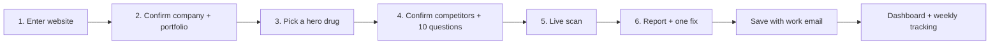

# Aeon User Journey: Pharma Onboarding (v2, agentic)

Sep 26, 2026 · @Abdul Rehman Khan

v2 turns the onboarding into a set of agents that do real work with real tools, replaces scores with yes/no checks, and adds the dashboard that users return to. v1's principles still hold.

## The goal

A pharma marketer types one thing, their company website, and sees how AI talks about their drugs in about 5 minutes. Everything else is inferred by agents, shown back, and confirmed with a click.

This doc covers pharma manufacturers only (Rx, OTC, biotech), US labels only.

### Onboarding principles

1. **One input.** Company website URL. No forms about therapeutic areas, keywords or competitors.
2. **Confirm, don't configure.** Agents propose the portfolio, competitors and questions; the user ticks or unticks. Nothing starts blank.
3. **Value before signup friction.** The first scan runs on an anonymous account. We ask for a work email only to save.
4. **Facts, not scores.** Every result is a yes/no check with the AI answer behind it ("Claude recommends Protopic, not you"). No percentages, no 0–100 scores: they swing between runs and invite arguments about the math.
5. **Every screen has one primary button.**
6. **Defaults are pharma-safe.** Everything is grounded in the FDA label. Users never see the word "lane".
7. **Nothing is locked in.** Everything confirmed during onboarding is editable later.

## How it works: agents, not a script

Aeon is built on the Anthropic Python SDK. Agents run on the SDK's tool runner (`client.beta.messages.tool_runner`): Claude decides which tool to call next, the tool runs, and the loop continues until the job is done. We don't use LangChain, LangGraph or the Claude Agent SDK. They add layers we'd have to debug, and the tool runner already gives us the loop, typed tools and per-turn hooks.

We only use an agent where the next step depends on what was just found. Measurement stays a plain workflow, because an agent's own instructions would change the answers we're measuring.

| Step | Type | What Claude decides | Tools |
|---|---|---|---|
| Discovery | Agent | Which pages to read, which names are products, which labels are theirs | Web fetch and web search (Anthropic), openFDA label lookup, `record_company`, `record_product` |
| Setup | Agent | Which competitors truly compete, which real questions matter | DataForSEO questions people ask on Google, openFDA verification, `record_competitor`, `record_question` |
| Scan | Workflow | Nothing: fixed questions, fixed engines | Claude with web search (asked 3×), Google AI Overviews + AI Mode via DataForSEO |
| Checks | Workflow | Yes/no per answer | Claude structured output against the FDA label |
| Fix this | Agent (evaluator–optimizer) | How to revise until the draft passes | `get_label_section`, `check_draft` (pre-MLR checklist), `submit_draft` |
| Promo opportunities | Agent | Which competitor ad themes are worth answering, and how on-label | Competitor ads from the Meta Ad Library via Apify, `get_label_section`, `record_opportunity` |
| Weekly tracking | Scheduler | Nothing: re-runs the scan weekly and shows what changed | Same as Scan |

Every agent run is traced in Langfuse: each tool call, each Claude call, its cost and its result.

### Vendors

Only four: **Anthropic** (Claude), **DataForSEO** (Google AI Overviews, AI Mode, questions people ask, citation data), **Apify** (competitor ads), and **openFDA** (free public label data, no key). Supabase hosts the data and accounts; Langfuse hosts traces and evals.

## The journey at a glance

| Step | User does | Time | Agent behind it |
|---|---|---|---|
| 1. Enter website | Types `acmepharma.com` | 5 s | Discovery agent reads the site and pulls FDA labels (~30–60 s) |
| 2. Confirm portfolio | Unticks anything wrong | 30 s | — |
| 3. Pick hero drug | Clicks one card | 5 s | Setup agent starts in the background |
| 4. Confirm competitors + questions | Glances, clicks Run | 30 s | — |
| 5. Live scan | Watches the grid fill | ~2 min | Scan workflow (10 questions × 3 engines) |
| 6. Report | Reads the checks, clicks one fix | 1 min | Fix agent drafts and self-reviews (~1 min) |

## Screen by screen

### Screen 1: "How does AI talk about your drugs?"

- **User sees:** one input, "Your company website", and "Scan my brands". No account; an anonymous session starts silently.
- **Behind it:** the discovery agent reads the homepage and product pages with Claude's web fetch, follows links to brand sites, looks the company up as a labeler in openFDA, and records each product it can match to an FDA label.
- **While waiting:** the checklist shows what the agent is actually doing, one row per tool call: "Reading incyte.com/products…", "Found Opzelura's FDA label", "Checking Iclusig: labeled by Takeda".

### Screen 2: "Here's what we found"

- Company card (name, HQ, type, therapeutic areas) and product cards: brand, molecule, one-line indication, Rx/OTC, "FDA label found".
- Products labeled by another company ("Labeled by Eli Lilly") start unticked and can't be the hero. Pipeline drugs are listed, not scanned.
- If the site maps to several labelers: one question, "Which of these are you?"
- "Add a product": type a brand, we fetch its label.
- **Primary button:** "Looks right".

### Screen 3: "Which drug should we start with?"

- Big cards for the confirmed products, one pre-selected (most Google search demand, from DataForSEO).
- Picking one starts the setup agent in the background, so Screen 4 is ready on arrival.

### Screen 4: "Who you're up against and what people ask"

- **Competitors:** 4–6 chips. The agent proposes drugs for the same indication and keeps only the ones with a US FDA label. Removable, with "+ add".
- **10 questions** grouped as Patients, Caregivers, Doctors:
  - 6 unbranded (condition and treatment, never naming a drug). Taken from real questions people ask on Google where possible, marked "Asked on Google".
  - 2 branded ("How is Opzelura applied?").
  - 2 comparisons ("Opzelura or Protopic for a 4-year-old?").
- **Engines:** Claude, Google AI Overviews and Google AI Mode are live. ChatGPT, Gemini and Perplexity show as "coming soon" (they arrive through DataForSEO, no new vendor).
- **Primary button:** "Run my first scan".

### Screen 5: Live scan

- The question × engine grid fills live. Each cell becomes a check: **you** (named, and at what position), **competitor instead**, **not mentioned**, **no AI Overview shown** (Google didn't show one; neither good nor bad), plus a red flag when the answer contradicts the label.
- Header counters are plain counts: "answers read", "mention you", "name a competitor", "label conflicts".

### Screen 6: "Your AI visibility report"

Top to bottom:

1. **Where AI recommends you:** one line per engine, as counts of checks. "Claude mentions Opzelura in 4 of 6 unbranded questions. Protopic: 5 of 6."
2. **Red box:** statements that contradict the label, the AI sentence next to the label sentence.
3. **Where you lose:** the unbranded questions where a competitor is recommended and you're not.
4. **Why:** the sources AI cites for competitors and not for you, across Claude, AI Overviews and AI Mode.
5. **Top 3 fixes**, each with "Fix this".

**Fix this:** the fix agent drafts from the label only, calls `check_draft`, reads which checks failed, revises, and checks again (up to 3 rounds). The UI shows each round: "Round 1: fair balance ✗ → revised → Round 2: all checks pass". The result is a draft plus the pre-MLR checklist below plus a claim-to-label table, exportable as an MLR package (Word/PDF with references) for any review tool, including PromoMats.

**Save gate:** "Save this report and track weekly": work email, confirmed by magic link. The anonymous account becomes theirs; nothing is lost.

**Share:** the report link is public and read-only, for their boss or medical affairs.

## Checks, not scores

Every check is yes/no and shows the answer behind it.

| Check | Yes when |
|---|---|
| Mentions you | The answer names the brand or molecule |
| Competitor instead | It names a tracked competitor and not you |
| Matches your label | Nothing it says about your drug contradicts the FDA label (only checked when you're mentioned) |
| Cites your sites | A cited source is on your corporate or brand domains |

**Stability.** Claude's answers vary, so each question is asked 3 times, and a check is ✓ when at least 2 of 3 answers agree. Google returns one AI Overview per query and location, so it's fetched once; "no overview shown" is its own state. Summaries are counts of checks, never percentages.

### Pre-MLR checklist (replaces the risk score)

| Check | How |
|---|---|
| Every claim traced to the label | Rule: each claim's quote must appear verbatim in the label. A miss blocks export. |
| On-label only (indication, population, dose) | AI reviewer against the label |
| No overstatement ("safe", "cure", superlatives, unqualified numbers) | Rule |
| Fair balance (risk as prominent as benefit) | Rule + AI reviewer |
| Important Safety Information present, boxed warning first | Rule |
| No comparison without head-to-head data | AI reviewer |

Result: **Ready for MLR review** (all pass), **Needs changes** (the fix agent keeps revising), or **Blocked** (an untraceable claim).

## After onboarding: the dashboard

The report is the first page of a dashboard people come back to weekly, in the same space as Peec AI and Profound. Those report visibility as percentages across engines. Aeon shows checks with the answer behind each one, plus what they don't have: label accuracy and MLR-ready fixes.

| Page | What it answers |
|---|---|
| Overview | This week's checks per engine, what changed since last week, label conflicts, next scan |
| Questions | The question × engine grid with every answer and its sources |
| Competitors | Where each competitor appears, on which engines, and which sources AI cites for them |
| Sources | Domains cited for you vs only for competitors: where to get content placed |
| Opportunities | Competitors' current ad themes (Meta Ad Library) and an on-label angle for each, with "Draft this" |
| Content | Drafts and their pre-MLR checklist status |
| Tracking | Weekly re-scan on/off, history |

| When | What happens | Nudge |
|---|---|---|
| Day 0 | First report saved; one draft created | "Add your other products" |
| Weekly | Re-scan of the same 10 questions per tracked drug | "What changed in AI answers about your brands" |
| After a fix is published | Re-scan shows whether the checks flipped | Before/after they can share internally |

## How it changes by persona

One optional question on the report, "What's your role?", changes what it leads with.

| Persona | Leads with | First action |
|---|---|---|
| Brand / marketing | Where AI recommends you, where you lose | "Fix this" on the top lost question |
| Medical affairs | Label conflicts | Correction drafts |
| Regulatory / MLR | Pre-MLR checklist on waiting drafts | Review |
| Agency | Where you lose, sources | "Add client" |

## Pharmacovigilance

Pharmacovigilance is drug-safety monitoring. US law (21 CFR 314.80) requires a drug company to collect, assess and report adverse events about its drugs from any source it comes across, including social media it monitors. What that means for Aeon:

- **AI answers:** low risk. We read AI-generated answers, not patient reports.
- **Competitors' ads (Apify):** fine. Promotional content, not patient posts.
- **Patient posts about the client's own drug (social, Reddit):** not in scope. If we add it, we first add an adverse-event detector and a documented handoff to the client's safety team.

## Infrastructure

- **Supabase Postgres** holds everything: companies, products, questions, answers, reports, drafts, and the job queue with its progress events. Jobs survive a restart: the backend resumes unfinished jobs, and progress streams read from the database.
- **Supabase Auth:** anonymous sign-in on first visit, email magic link at the save gate (same user id). Reports are public by link; everything else belongs to its account.
- **Backend:** FastAPI, one process running the API, the job worker and the weekly scheduler.
- **Langfuse:**
  - **Traces:** one per job, with nested agent steps, tool calls and Claude calls (tokens, cost, latency).
  - **Evals:** datasets for the label check, the pre-MLR checklist and the fix loop, run as experiments before any prompt or model change. Their results are pass/fail too.

## Cost

Budget: about €20–30 for the hackathon. Development runs on recorded runs (demo mode) and saved API responses; live runs are for demos.

| Per full live run (10 questions) | Approx. |
|---|---|
| Discovery + setup agents (Claude Opus 5) | $0.5–1.0 |
| Claude scan: 10 questions × 3 samples, web search on | $1.5–2.5 |
| Google AI Overviews + AI Mode (DataForSEO) | ~$0.10 |
| Label checks (label cached across calls) | $0.2–0.4 |
| One "Fix this" loop (up to 3 rounds) | $0.3–0.8 |
| Competitor ads (Apify, ~10 ads per competitor) | $0.1–0.3 |
| **Total** | **~$3–5** |

Weekly tracking re-runs only the scan and checks: about $2 per drug per week.

## What we will not do

- No setup wizard. Six screens, three real decisions.
- No blank states. Every list arrives pre-filled.
- No scores or percentages. Checks and counts only.
- No jargon in onboarding: no "lanes", "GEO" or "share of voice".
- No account before value.
- No full-portfolio first scan. One hero drug first.
- No monitoring of patient social posts without the pharmacovigilance handoff above.

## Open questions

- **More engines:** ChatGPT, Gemini and Perplexity through DataForSEO's LLM endpoints (+~$0.3–1 per scan). Turn on when the budget allows.
- **Non-US companies:** EMA/SmPC labels. Not for the hackathon.
- **Pharmacies and telehealth:** separate product model (services, not labels).
